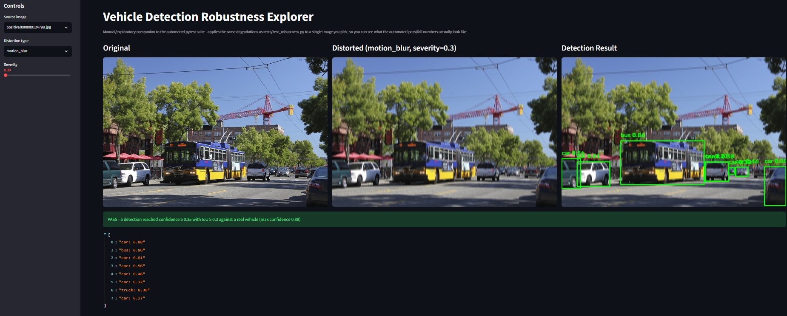
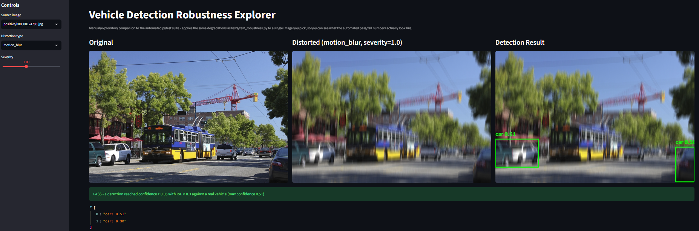
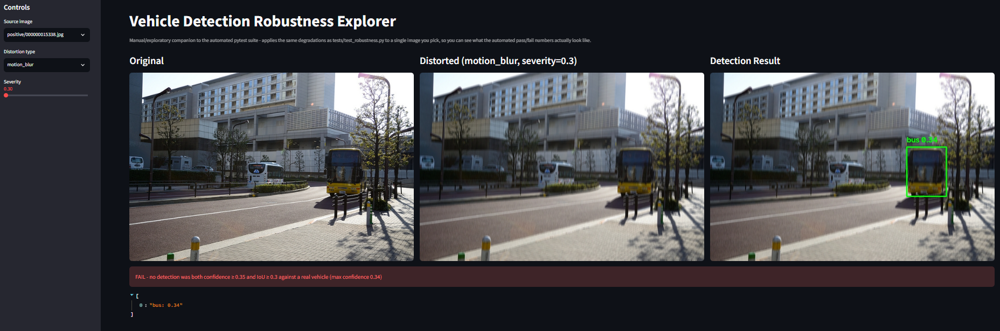
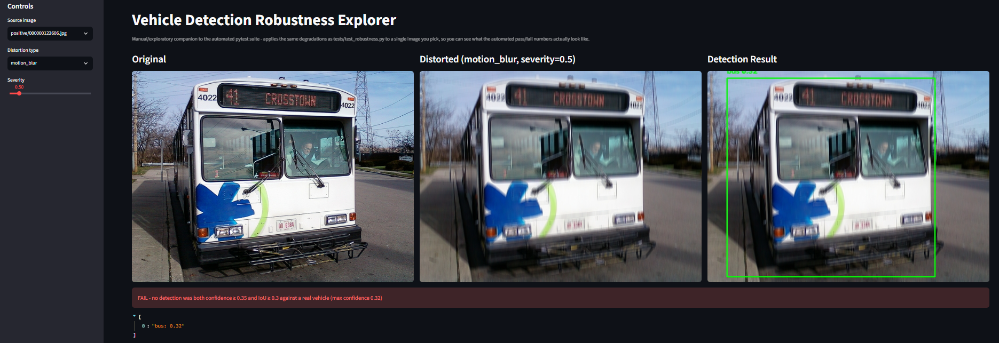
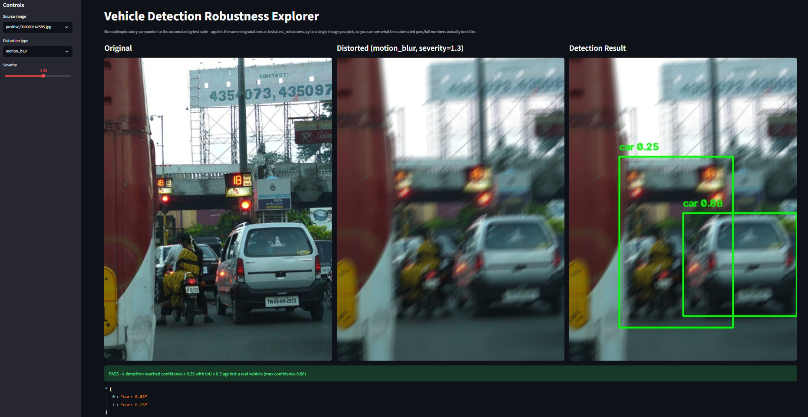

# Vehicle Detection - Automated Test Suite

An automated QA test suite that treats a pretrained YOLOv8 vehicle-detection model as a system
under test: functional correctness, accuracy metrics, robustness to real-world degradation,
latency/throughput SLAs, and regression tracking against a stored baseline - the workflow
described in Genetec's *Software Tester - Computer Vision & Machine Learning* posting. See
[PRD_Automated_Detection_Test_Suite.md](PRD_Automated_Detection_Test_Suite.md) for the full spec.

`<!-- once pushed to GitHub, replace the line below with: -->`
``

## Test strategy

| Category | File | PRD | What it checks |
|---|---|---|---|
| Functional | `tests/test_functional.py` | 5.1 | Detects vehicles on positives, no false positives on negatives, IoU >= 0.5 vs. ground truth, correct class label |
| Accuracy | `tests/test_accuracy.py` | 5.2 | Precision/recall/F1 (scikit-learn), mAP@0.5 (torchmetrics), per-class breakdown |
| Robustness | `tests/test_robustness.py` | 5.3 | Detection confidence under 5 synthetic degradations: motion blur, low light, occlusion, rotation, JPEG compression |
| Performance | `tests/test_performance.py` | 5.4 | Average CPU inference latency SLA, FPS throughput on a sample video clip |
| Regression | `tests/test_regression.py` | 5.5 | Compares a fresh run against a stored baseline; includes a deliberately-degraded config to prove the comparison logic actually catches a real drop |

16 test cases total. All pass-fail thresholds in this suite are calibrated against an observed
YOLOv8n baseline on this dataset (2026-07-11) rather than picked arbitrarily - see each test
module's docstring and Known Limitations below for the reasoning and the real numbers.

## Setup

```bash
python -m venv .venv
./.venv/Scripts/activate        # Windows
pip install -r requirements.txt
python -m src.data_loader       # pulls the COCO vehicle subset via fiftyone (one-time)
python -m src.video_utils       # synthesizes the sample clip used by the FPS test (one-time)
```

`data/images/`, `data/labels/`, `data/video/`, and `baselines/baseline_metrics.json` are already
committed to this repo, so a fresh clone can skip straight to **Run the suite** below - the two
commands above are only needed if you want to regenerate them (e.g. a larger sample, different
seed).

## Run the suite

```bash
pytest --html=reports/report.html --self-contained-html
```

> If `pytest` fails immediately with `ModuleNotFoundError: No module named 'lark'` (or similar)
> from a `launch_pytest`/ROS traceback, a global `PYTHONPATH` on your machine is injecting an
> unrelated system package's pytest plugin. Clear it for this command: `PYTHONPATH= pytest ...`
> (bash) or `$env:PYTHONPATH=''; pytest ...` (PowerShell). This is a local-machine quirk, not a
> project issue - GitHub Actions CI doesn't hit it.

To regenerate the regression baseline (e.g. after intentionally changing model config):

```bash
python -m src.regression
```

## Interactive demo (Streamlit)

`app.py` is a visual, interactive complement to the automated pytest suite: pick an image, pick
one of the same 5 degradations `tests/test_robustness.py` exercises, and see the original,
distorted, and detected-with-boxes versions side by side, plus a pass/fail readout using the same
genuine-detection criteria the automated suite uses. It exists for two things the HTML report
can't do on its own - **demos** (showing, not just telling, what the model does under degradation)
and **manual/exploratory testing** (poking at a specific image or distortion the automated
thresholds don't call out individually - this is exactly how the "confident hallucination on
motion-blurred images" finding below got discovered).

How it works: it's plain [Streamlit](https://streamlit.io) (a Python-only web UI framework - no
HTML/JS needed) as the UI layer, and it imports `src/model.py`, `src/augmentation.py`,
`src/metrics.py`, and `src/config.py` directly rather than reimplementing anything. Concretely:
- `src/config.py` holds `ROBUSTNESS_CONFIDENCE_FLOOR` and `ROBUSTNESS_MIN_IOU`, imported by both
  `tests/test_robustness.py` and `app.py`, so the demo's pass/fail line and the automated suite's
  thresholds can never silently drift apart.
- A detection only counts as a genuine pass (not just a confident one) if it's *also* within
  `ROBUSTNESS_MIN_IOU` of a real ground-truth box - `src/metrics.py::is_robust_detection`, reused
  by both. This exists because a confident detection isn't necessarily correct: exploratory
  testing with the app surfaced a case where motion blur produced a large, confident, but entirely
  spurious box with no real overlap with any vehicle - a hallucination that a confidence-only
  check would have wrongly called a pass. On positive images (which have ground truth), a
  detection must clear both bars; on negative images (no ground truth to match against), pass/fail
  is a plain false-positive check instead (no confident detections at all).
- `src/augmentation.py`'s `apply_variant(...)` takes the same `severity` parameter the sidebar
  slider controls (default `severity=1.0` reproduces the exact parameters the automated tests
  use), and optionally transforms ground-truth boxes alongside the image (`boxes=...`) - needed
  for `rotation` specifically, since it's the only degradation that actually moves pixels, so
  comparing a rotated detection against a stale, unrotated ground-truth box would be an
  apples-to-oranges IoU rather than a real signal.
- `src/model.py`'s `VehicleDetector` is the same wrapper the whole test suite runs against.

Run it with:

```bash
streamlit run app.py
```

## Findings

Beyond the automated suite's aggregate numbers, exploratory testing with `app.py` surfaced
several distinct, explainable failure and success patterns — the kind of insight a single
pass/fail rate can hide. These are observations from manually testing specific images across
severity levels, not yet re-verified across the full dataset (see "further work" note at the end).

### Dense, multi-vehicle scenes degrade gracefully

A scene with 6-8 vehicles at varied distances still had 2 surviving detections even at maximum
severity (1.0) — enough visual redundancy that losing some detections as blur increases still
leaves others intact.

| Severity 0.3 | Severity 1.0 |
|---|---|
|  |  |

### Occluded or distant single-vehicle scenes collapse abruptly

A partly tree-occluded bus was already at only 0.34 confidence at the mildest blur setting —
already too marginal to have any real margin before failing outright one severity step later.



### Close, front-on, low-texture vehicles also fail fast — for a different reason

A bus filling most of the frame head-on, with a flat, mostly single-color surface, had already
dropped to a single weak detection (0.32) by severity 0.5, and lost it entirely one step later.
With few edges or texture cues to begin with, and no other objects in frame to fall back on, blur
removes the model's only anchors almost immediately — a different mechanism from the occlusion
case above, but a similarly abrupt failure.



### Hallucinations occur at two confidence tiers, and only one was silently passing

At severity 1.3, motion blur on a busy toll-booth scene produced both a correct detection
(`car 0.88`, a real vehicle) and a spurious one (`car 0.25`, a box drawn around the traffic-light
gantry structure — not a vehicle at all). The weak hallucination sits below
`ROBUSTNESS_CONFIDENCE_FLOOR` and is correctly excluded from the pass/fail result by the
confidence check alone. A separate, more confident hallucination (0.41, labeled "bus," spanning an
unrelated building) found earlier in testing is what motivated the IoU-based fix described in
"Known limitations" below — a confidence-only check would have wrongly scored that one a pass.



Together, these confirm the suite's two safeguards — the confidence floor and the IoU check — are
each doing real, distinct work, rather than one making the other redundant.

**What this suggests:** the model's real vulnerability isn't "motion blur" in the abstract — it's
*motion blur applied to a scene that was already visually marginal* (occluded, distant, or
texture-sparse), whereas scenes with strong, redundant visual signal tolerate the same distortion
far better. This is directly relevant to a smart-camera/ALPR deployment context, where distant or
partially-occluded vehicles are a routine operating condition, not an edge case.

**Further work:** these scene-composition patterns (density, occlusion, proximity, texture) are
currently anecdotal, drawn from manually exploring a handful of images via `app.py` rather than
measured systematically. A natural extension would be tagging the dataset by these
characteristics and re-running `test_robustness.py` per tag, to confirm the pattern holds at
scale rather than in the specific examples observed here.

## Structure

```
data/
  images/positive/    50 curated COCO images containing car/truck/bus
  images/negative/    20 curated COCO images with no vehicles (false-positive check)
  labels/              ground-truth boxes per image, pixel xyxy (JSON)
  video/                synthesized short clip for the FPS throughput test
baselines/
  baseline_metrics.json   "known good" precision/recall/F1/mAP/latency, for regression comparison
src/
  model.py             YOLOv8 inference wrapper (car/truck/bus only)
  data_loader.py         pulls the COCO subset via fiftyone
  video_utils.py           synthesizes the sample clip from curated images
  metrics.py                IoU matching, precision/recall/F1, mAP@0.5
  augmentation.py             degraded-image variants (albumentations), severity-scalable
  regression.py                 baseline load/save + comparison logic
  config.py                       shared thresholds (used by tests/ and app.py)
app.py                  Streamlit interactive demo (see "Interactive demo" above)
tests/
  conftest.py           shared fixtures (detector, image sets, ground truth)
  test_functional.py       PRD 5.1
  test_accuracy.py           PRD 5.2
  test_robustness.py           PRD 5.3
  test_performance.py            PRD 5.4
  test_regression.py               PRD 5.5
reports/                 generated HTML report
.github/workflows/test.yml   CI pipeline (GitHub Actions)
```

## Known limitations

- Dataset is a small curated COCO-2017 subset (50 positive / 20 negative images), not the full
  validation set - sized for fast iteration, not statistical rigor.
- Scoped to car/truck/bus only, per PRD.
- **YOLOv8n under-recalls `truck`** relative to `car`/`bus` on this dataset (observed baseline,
  2026-07-11: precision 0.67, recall 0.37, F1 0.48) - likely visual confusion with car/bus in the
  COCO ontology. The accuracy test suite's per-class floor is deliberately set below the aggregate
  floor to reflect this real, tracked baseline rather than hide it.
- **YOLOv8n is notably fragile to motion blur, and it fails in a binary way, not gradually**:
  genuine robust-detection rate (confidence >= 0.35 AND IoU >= 0.3 vs. ground truth, after
  degradation) is 26% under synthetic motion blur, vs. 80% under occlusion and JPEG compression,
  72% under rotation, and 50% under low light. Checking every positive image individually shows
  this isn't a smooth confidence decay - 36/50 images (72%) drop to *exactly* 0.00 confidence
  (zero detections) under motion blur at default severity, regardless of how confident the
  undistorted detection was (several 0.90+ baseline detections collapse completely). Only the
  remaining ~28% retain meaningful confidence, often close to their original value. This is a
  genuine, documented model weakness surfaced by the robustness suite (and reproducible
  interactively via `app.py`'s severity slider), not a test artifact - the kind of finding this
  project exists to catch. A production deployment on motion-heavy camera feeds would need either
  a larger model, motion-compensated preprocessing, or a lowered confidence threshold with
  downstream filtering.
- **A confident detection is not always a correct one.** Exploratory testing with `app.py`
  surfaced a case where moderate motion blur produced a large, confident (0.41) box labeled "bus"
  spanning almost an entire unrelated building, with no real overlap with any vehicle - a
  hallucination, not a robust detection. The original robustness check only tested confidence, so
  it would have silently counted this as a pass. `src/metrics.py::is_robust_detection` now also
  requires IoU >= `ROBUSTNESS_MIN_IOU` (0.3) against the nearest ground-truth box, shared by both
  `tests/test_robustness.py` and `app.py`. In practice this barely moved the measured rates above
  (only `low_light` dropped, 52% -> 50%), which is reassuring - this model isn't frequently
  hallucinating on this dataset - but the check now guards against that failure mode going
  forward. `rotation` needed a further fix to measure fairly: it's the only degradation that
  actually moves pixels, so ground-truth boxes are now transformed alongside the image
  (`apply_variant(..., boxes=...)`) rather than compared against their stale, unrotated
  coordinates - without that fix, rotation's rate was a misleading 50% (measuring coordinate
  mismatch, not model quality) instead of its real 72%.
- Functional tests use rate-based tolerances (not zero-tolerance) for miss rate and false-positive
  rate, calibrated against the observed YOLOv8n baseline - a nano model won't hit 100% on a raw,
  uncurated COCO sample, and COCO's own instance annotations aren't guaranteed exhaustive (an
  unlabeled background vehicle in a "negative" image is a labeling gap, not necessarily a model
  defect).
- CPU-only latency/FPS numbers are hardware-dependent; SLA constants in
  `tests/test_performance.py` are calibrated for the development machine and should be
  re-baselined on deployment/CI hardware.
- **Wall-clock latency is noisy on a shared dev machine**: repeated runs with identical model
  config and images showed swings up to +39% (70ms -> 98ms) purely from background system load,
  not a real slowdown. `src/regression.py`'s latency tolerance (60%) is set wide enough to absorb
  that noise and only flag a genuine multi-x regression; the absolute SLA ceiling in
  `tests/test_performance.py` is the authoritative latency check.
- The regression suite's baseline was generated from this same YOLOv8n configuration, so
  `test_current_run_matches_baseline` is expected to pass by construction; the deliberately
  degraded-config test (`test_regression_detection_catches_degraded_config`) is what actually
  proves the comparison logic detects a real drop.

## Resume bullet

Built an automated QA test suite (Python, pytest, YOLOv8/Ultralytics) that validates a
vehicle-detection model across 16 test cases spanning functional correctness, accuracy metrics
(precision/recall/F1/mAP@0.5 via scikit-learn and torchmetrics), robustness to synthetic
degradation (motion blur, low light, occlusion, rotation, JPEG compression via albumentations),
CPU latency/throughput SLAs, and regression tracking against a stored baseline - surfacing real
model weaknesses (e.g. a 26% robust-detection rate under motion blur) rather than hiding them
behind loosened thresholds, with CI (GitHub Actions) and an auto-generated HTML report.
